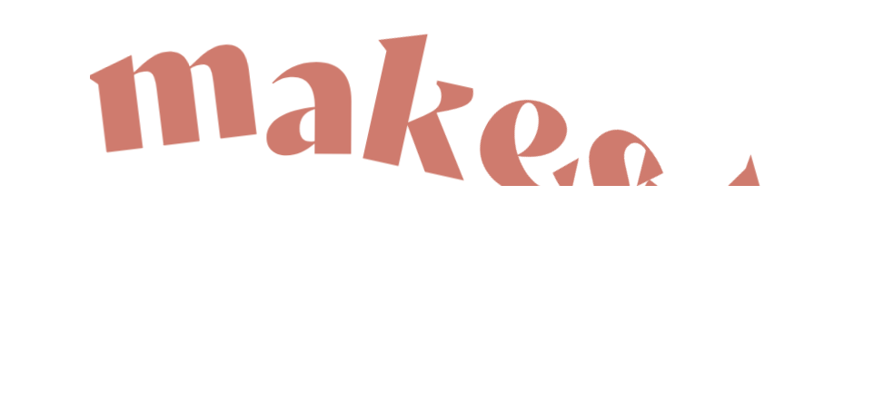
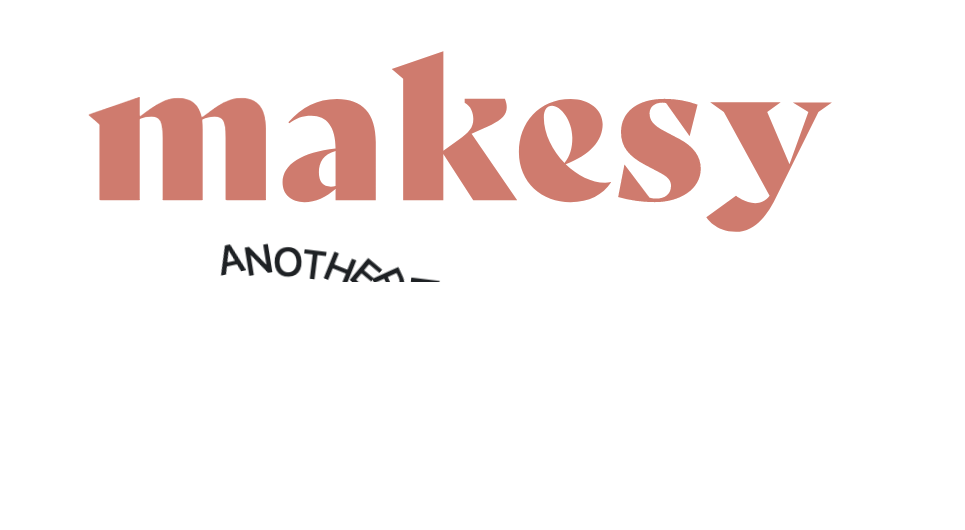
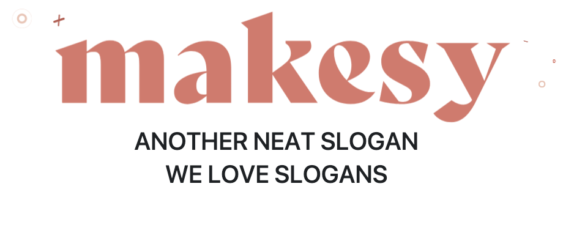

## Installation
    * clone
    * run script.js to your html file
    * Use with cdn links:
        
        <link rel="stylesheet" href="https://cdn.jsdelivr.net/gh/bradicalone/word-reveal/assets/css/style.css">

    * data-word-index - will display the order of the animation
    * data-word-index needs to directly display the children of the text you want to animate

